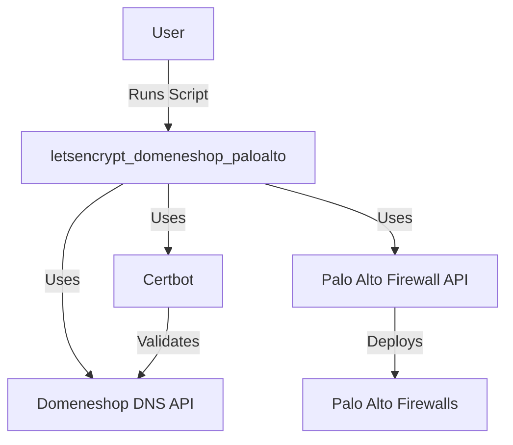
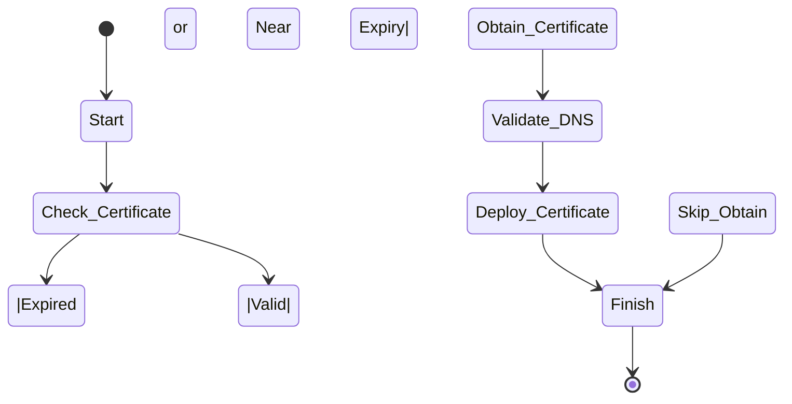

# letsencrypt_domeneshop_paloalto

*This project is a heavily modified fork of [https://github.com/psiri/letsencrypt_paloalto](https://github.com/psiri/letsencrypt_paloalto). Credit to the original author for foundational work.*

---

## Overview

`letsencrypt_domeneshop_paloalto` is an automated solution designed to simplify the process of obtaining and deploying Let's Encrypt SSL certificates for domains managed through Domeneshop DNS and Palo Alto Networks firewalls. It leverages Certbot for certificate issuance, interacts with Domeneshop's DNS API for domain validation, and uses Palo Alto's API to deploy certificates securely.

This tool is ideal for network administrators and security engineers looking to streamline SSL certificate management across multiple domains and firewalls with minimal manual intervention.

---

## Features

- **Automated Certificate Issuance:** Seamless integration with Certbot to request and renew SSL certificates.
- **Domeneshop DNS Integration:** Uses Domeneshop API for DNS-01 challenge validation.
- **Palo Alto Networks Deployment:** Automatically uploads and installs certificates on Palo Alto firewalls via API.
- **Multi-Domain and Multi-Firewall Support:** Manage multiple domains and deploy to multiple firewalls.
- **Scheduled Renewals:** Supports cron or scheduler-based automated renewals and deployments.
- **Detailed Logging:** Comprehensive logs for troubleshooting and audit purposes.
- **Configurable:** Flexible YAML-based configuration for easy customization.

---

## Architecture Diagram



---

## Lifecycle Graph



---

## Project Structure

```
letsencrypt_domeneshop_paloalto/
├── main.py               # Main execution script
├── config.yaml           # Configuration file
├── certbot_hooks.py      # Scripts/hooks for Certbot integration
├── domeneshop_api.py     # Domeneshop DNS API client
├── paloalto_api.py       # Palo Alto Networks API client
├── README.md             # Project documentation
├── requirements.txt      # Python dependencies
└── logs/                 # Directory for log files
```

---

## Installation

1. **Clone the repository:**

   ```bash
   git clone https://github.com/yourusername/letsencrypt_domeneshop_paloalto.git
   cd letsencrypt_domeneshop_paloalto
   ```

2. **Create a virtual environment (recommended):**

   ```bash
   python3 -m venv venv
   source venv/bin/activate
   ```

3. **Install dependencies:**

   ```bash
   pip install -r requirements.txt
   ```

4. **Install Certbot:**

   Follow instructions from [Certbot's official site](https://certbot.eff.org/) to install Certbot on your system.

---

## Configuration

The main configuration is stored in `config.yaml`. Below is a sample configuration structure:

```yaml
domains:
  - example.com
  - www.example.com

domeneshop:
  api_key: YOUR_DOMENESHOP_API_KEY
  api_secret: YOUR_DOMENESHOP_API_SECRET

paloalto:
  firewalls:
    - host: firewall1.example.com
      api_key: FIREWALL1_API_KEY
    - host: firewall2.example.com
      api_key: FIREWALL2_API_KEY

certbot:
  email: admin@example.com
  staging: false
  cert_path: /etc/letsencrypt/live/example.com
  renew_before_expiry_days: 30
```

- **domains:** List of domains to secure.
- **domeneshop:** Credentials for Domeneshop DNS API.
- **paloalto:** List of Palo Alto firewalls with their API keys.
- **certbot:** Certbot related settings.

Make sure to replace placeholders with your actual credentials.

---

## Using Certbot with Domeneshop DNS

The project uses Certbot's DNS-01 challenge with custom hooks to add and remove TXT records via Domeneshop API.

- **Manual Run:**

  ```bash
  certbot certonly \
    --manual \
    --preferred-challenges=dns \
    --manual-auth-hook ./certbot_hooks.py auth \
    --manual-cleanup-hook ./certbot_hooks.py cleanup \
    -d example.com -d www.example.com \
    --agree-tos \
    --email admin@example.com \
    --non-interactive
  ```

- The hooks will automatically manage DNS TXT records needed for validation.

---

## Deployment Script

After obtaining or renewing certificates, the deployment script uploads them to the configured Palo Alto firewalls:

```bash
python main.py
```

This script will:

- Check if certificates are near expiry.
- Trigger renewal if necessary.
- Deploy updated certificates to all listed firewalls.
- Log success and failure events.

---

## Automation

To automate renewals and deployments, add a cron job or systemd timer:

```cron
0 3 * * * /path/to/venv/bin/python /path/to/letsencrypt_domeneshop_paloalto/main.py >> /var/log/letsencrypt_domeneshop_paloalto.log 2>&1
```

This runs the script daily at 3 AM.

---

## Troubleshooting

- **Certificate renewal fails:**
  - Check DNS API credentials.
  - Verify DNS TXT records are correctly created.
  - Review Certbot logs in `/var/log/letsencrypt/`.

- **Deployment to firewall fails:**
  - Confirm firewall API keys and hostnames.
  - Check network connectivity.
  - Review logs in `logs/` directory.

- **General errors:**
  - Run script with `--debug` flag (if implemented).
  - Check Python dependencies and update if necessary.

---

## Roadmap

- Support for wildcard certificates.
- Enhanced logging and alerting.
- Web UI for monitoring.
- Support for other DNS providers.
- Integration with Palo Alto Panorama.

---

## Contributing

Contributions are welcome! Please submit issues and pull requests via GitHub.

- Fork the repository.
- Create a feature branch.
- Write tests and documentation.
- Submit a pull request.

---

## License

MIT License

---

## Credits

This project is a heavily modified fork of [https://github.com/psiri/letsencrypt_paloalto](https://github.com/psiri/letsencrypt_paloalto). Many thanks to the original author for their foundational work and inspiration.
